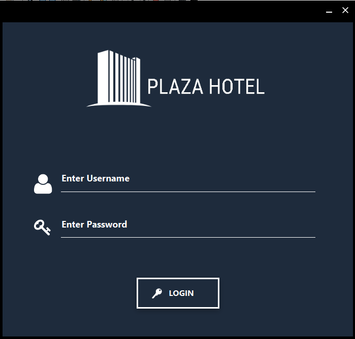

# Hotel Management System - JavaFX 

<strong>
Desktop Application to Manage the reservations and Guest Check-in or Check-Out Using JavaFX and SQL Database with Hibernate ORM. 
</strong>

## Getting Started

### Requirements
1. [Oracle JDK 8](https://www.oracle.com/java/technologies/javase/javase8u211-later-archive-downloads.html)
    
2. [XAMMP](https://www.apachefriends.org/index.html) for MySQL server.
  
3. [NetBeans IDE](https://netbeans.apache.org/)

### How to run

1. Open XAMMP control panel, then start `Apache` & `MySQL` services

2. Import [hotel.sql](/hotel.sql) to import the database.

3. Run the Program using [Project.java](/src/project/Project.java).

### For Login

1. Username=Takrim

2. Password=524295

## Demos

  <h2>Overview</h2>

-----

  <h2>Login</h2>

-----

  <h2>Check-In Process</h2>

-----

  <h2>Cancel Booking</h2>

-----

  <h2>Guests</h2>

----

  <h2>Room List</h2>

----

  <h2>Check Out Process</h2>

----

  <h2>Room Booking</h2>

----
